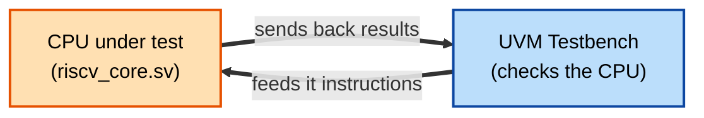
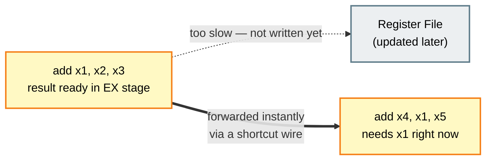
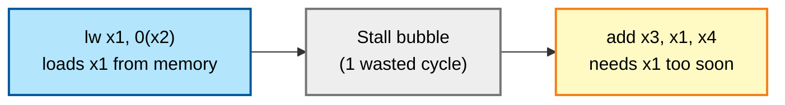
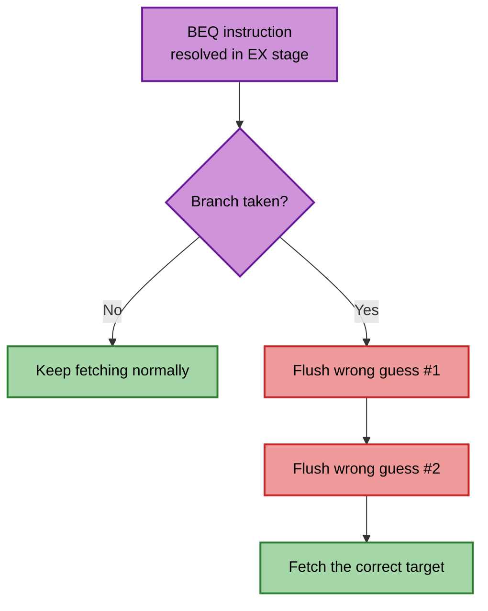
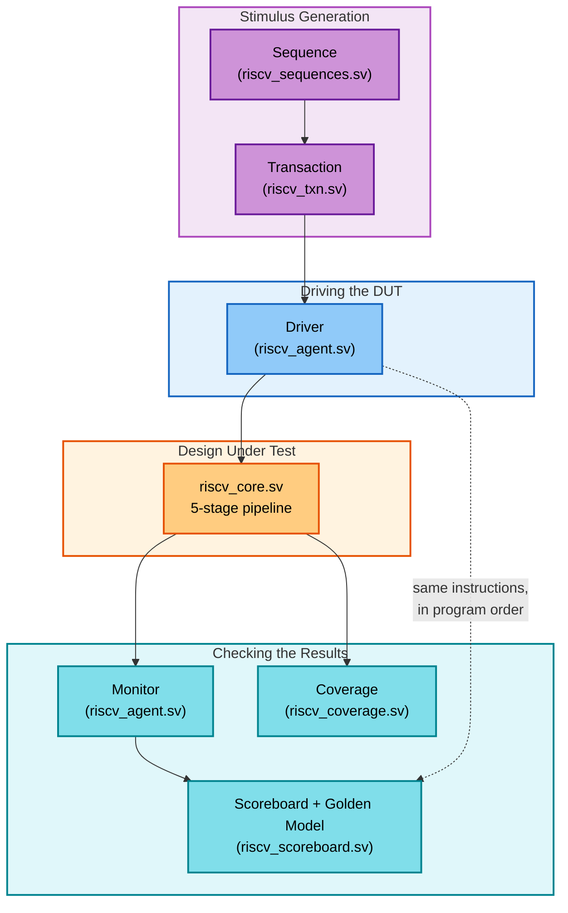
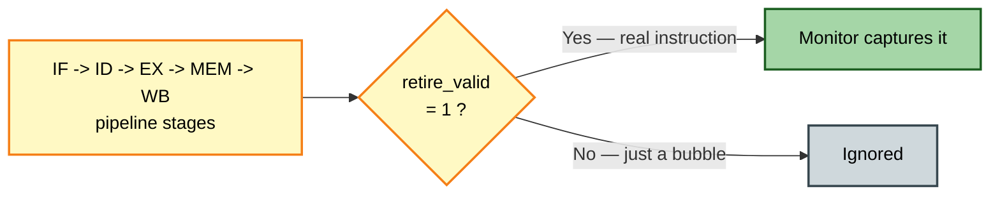
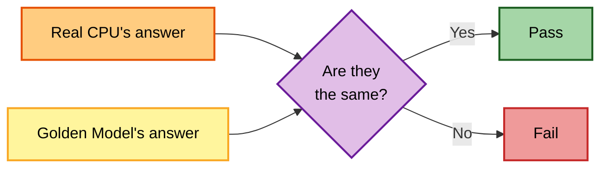
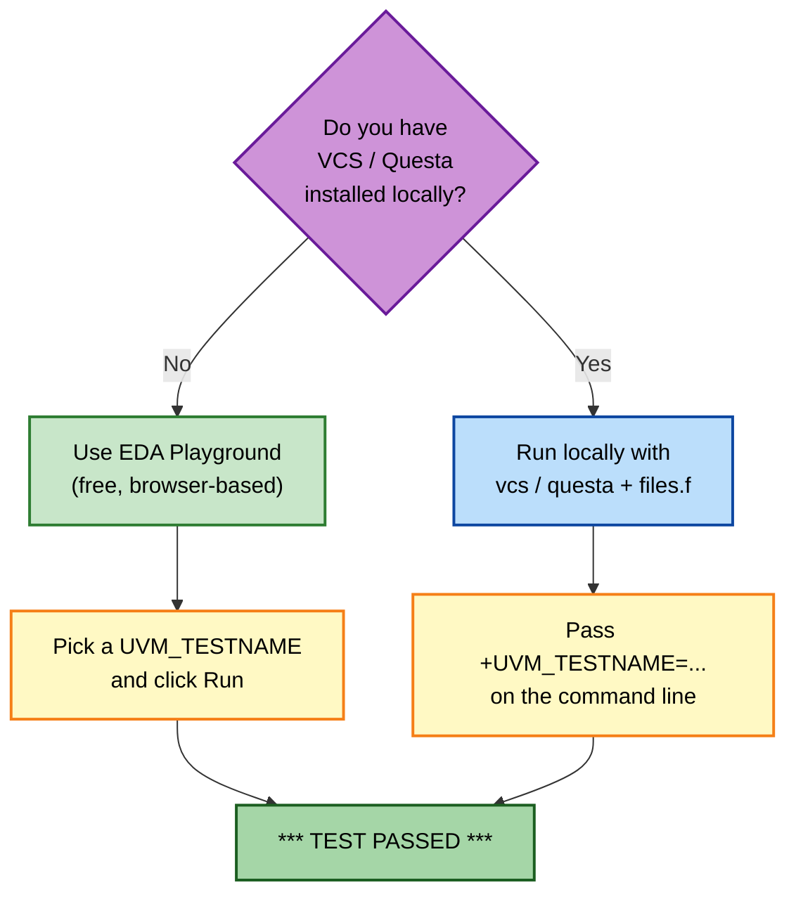
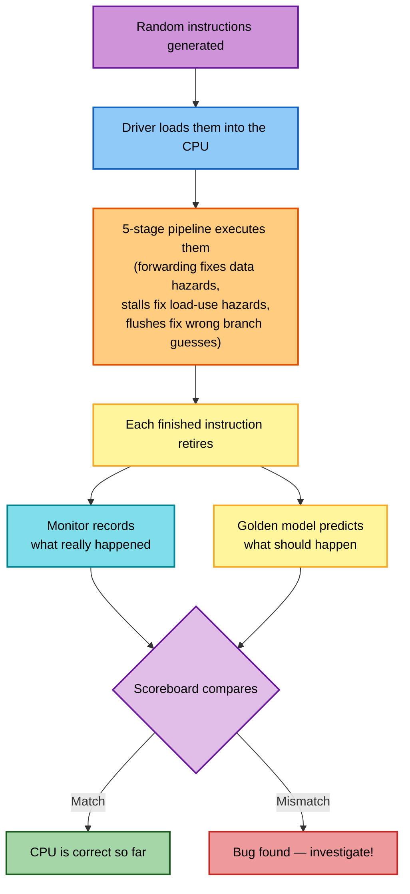

<div align="center">

# RISC-V Pipeline + UVM Verification
### *A Beginner's Guide — taught like a friendly classroom lesson*


</div>

> Think of this README as a friendly teacher sitting next to you, explaining
> what this project actually does — no jargon left unexplained, lots of
> pictures, zero assumptions.

---

## Quick Color Key

Throughout this guide, the same color always means the same thing — so once
you learn the key, every diagram below becomes easier to read:

| Color | Meaning |
|:---:|---|
| **Purple** | Randomization / test generation |
| **Blue** | Fetching / driving input into the chip |
| **Green** | Decoding / a "good" or passing outcome |
| **Yellow** | Computing / the trusted "golden model" |
| **Orange** | Memory access / the hardware (the chip itself) |
| **Red** | Write-back / a hazard / a bug |
| **Teal** | Watching, monitoring, or checking results |

---

## 1. What is this project, in one sentence?

We built a tiny **CPU** (the part of a computer that runs instructions) using
the **RISC-V** instruction set, and then we built a **robot tester** (using a
framework called **UVM**) whose only job is to throw random instructions at
the CPU and check that it never makes a mistake.



> [!NOTE]
> **DUT** = "Design Under Test" — just a fancy way engineers say
> "the chip we're testing."

---

## 2. What is a CPU "pipeline"? (the core idea)

Imagine a sandwich shop with **5 workers** standing in a line (an
assembly line), each doing exactly ONE job:


In CPU terms, the 5 workers are the **5 pipeline stages**:

| Stage | Nickname | What happens here |
|:---:|---|---|
| **IF** | Fetch | Grab the next instruction from memory |
| **ID** | Decode | Figure out *what* the instruction wants (add? load? branch?) |
| **EX** | Execute | Do the math (the ALU lives here) |
| **MEM** | Memory | Read or write data memory (for LOAD/STORE) |
| **WB** | Write Back | Save the result into a register |

**Why a pipeline at all?** Because while Worker 5 finishes sandwich #1,
Worker 1 has already started sandwich #2! Five sandwiches are "in flight"
at once — much faster than finishing one start-to-finish before starting
the next.

```
Time →      1      2      3      4      5      6      7
Instr 1   [IF]   [ID]   [EX]   [MEM]  [WB]
Instr 2          [IF]   [ID]   [EX]   [MEM]  [WB]
Instr 3                 [IF]   [ID]   [EX]   [MEM]  [WB]
```

> [!TIP]
> Try tracing **Instr 2** with your finger through the table above. That's
> exactly the journey every instruction takes through
> [`rtl/riscv_core.sv`](rtl/riscv_core.sv) — our tiny 32-bit RISC-V (RV32I)
> processor.

---

## 3. The 3 classic pipeline problems (and how we solved them)

### Problem 1 — "I need a value that isn't ready yet!" → fixed with **Forwarding**

```
 add  x1, x2, x3      ; x1 = x2 + x3   (result ready at end of EX)
 add  x4, x1, x5      ; needs x1 ... but x1 isn't written to the
                       ; register file yet!
```



**Fix — Forwarding (a shortcut wire):** instead of waiting for the value
to be written to the register file and read back out, we **forward** it
directly from a later stage straight into the EX stage that needs it — like
passing a note directly to your friend instead of mailing it.

This is the `fwd_a` / `fwd_b` logic inside [`rtl/riscv_core.sv`](rtl/riscv_core.sv).

### Problem 2 — "I need a value from MEMORY, but memory is slow!" → fixed with a **Stall**

```
 lw   x1, 0(x2)        ; load x1 from memory (result not ready until MEM stage)
 add  x3, x1, x4       ; immediately needs x1 — too soon, even forwarding can't help!
```



**Fix — Stall (a pause):** the pipeline detects this "load-use hazard"
and inserts a 1-cycle **bubble** (a do-nothing instruction) to buy time.

```
 lw   x1, 0(x2)   [IF]  [ID]  [EX]    [MEM]  [WB]
 add  x3, x1,x4         [IF]  [ID]  [stall] [EX]   [MEM]  [WB]
                                     ^ pipeline pauses for 1 cycle
```

### Problem 3 — "We guessed wrong about a branch!" → fixed with a **Flush**

```
 beq  x1, x2, target   ; "if x1==x2, jump elsewhere"
```

The CPU doesn't know if a branch is taken until the **EX** stage. By then,
it has already fetched the next 2 instructions assuming "no jump." If the
branch *is* taken, those 2 guesses were wrong — so we **flush** (throw
away) them, like crossing out two wrong guesses on a quiz.



```
 beq ...           [IF]  [ID]  [EX]  <- branch decided HERE
 (wrong guess #1)        [IF]  [ID]  (flushed)
 (wrong guess #2)              [IF]  (flushed)
 (correct instr)                     [IF]  (fetched from the right address)
```

---

## 4. What is UVM, and why do we need a "robot tester"?

**UVM** (Universal Verification Methodology) is a standard toolkit for
building automated test systems for chips. Instead of you manually checking
"did the CPU compute 2+2=4 correctly?" a thousand times, UVM lets you build
a robot that does it for you — thousands of times, with random instructions.

Think of it like a **factory inspection line**:



### The cast of characters (UVM components), explained simply

| Component | File | Beginner explanation |
|-----------|------|------------------------|
| **Sequence** | [`tb/riscv_sequences.sv`](tb/riscv_sequences.sv) | Writes random (but legal-ish) RISC-V "mini programs" to test with |
| **Transaction** | [`tb/riscv_txn.sv`](tb/riscv_txn.sv) | One instruction, packaged as an object (opcode, registers, etc.) |
| **Driver** | [`tb/riscv_agent.sv`](tb/riscv_agent.sv) | Takes each instruction and loads it into the CPU's instruction memory |
| **Monitor** | [`tb/riscv_agent.sv`](tb/riscv_agent.sv) | Watches the CPU's outputs (the "retire bus") without interfering |
| **Scoreboard** | [`tb/riscv_scoreboard.sv`](tb/riscv_scoreboard.sv) | The judge — re-computes the expected answer in software and compares |
| **Coverage** | [`tb/riscv_coverage.sv`](tb/riscv_coverage.sv) | A checklist: "did we test ADD yet? BRANCH? STORE?" |
| **Environment** | [`tb/riscv_env.sv`](tb/riscv_env.sv) | The container that wires all the pieces above together |
| **Interface** | [`tb/riscv_if.sv`](tb/riscv_if.sv) | The literal wires connecting the testbench to the CPU |

### What's a "retire bus"?

The CPU exposes a special set of signals (`retire_valid`, `retire_pc`,
`retire_rd_data`, …) that fire **only when a real instruction has finished
its full journey** through all 5 stages — like a "finished!" stamp on each
sandwich as it leaves the shop.



> [!IMPORTANT]
> The monitor watches *only* this "finished!" stamp, so it never gets
> confused by pipeline bubbles — the stalls and flushes from Section 3.

### What's a "golden model"?

It's a much simpler program (just normal code, not hardware) that does the
*same job* as the CPU — execute RISC-V instructions — but written to be
obviously correct, even if it's slow. We trust it 100%, and use it as the
"answer key" to grade the real (fast, hardware) CPU.



> [!CAUTION]
> The golden model must stay **deliberately simple and obviously correct**.
> If it had the *same* bug as the real CPU, the scoreboard would never
> catch it — that's why it's written independently, in plain software,
> instead of copying the hardware's logic.

---

## 5. Project map

```
riscv-uvm-pipeline/
│
├── rtl/                      The actual hardware design
│   ├── riscv_core.sv          -> the 5-stage CPU itself
│   └── riscv_top.sv           -> a thin wrapper connecting the CPU to the testbench wires
│
├── tb/                       The UVM testbench ("robot tester")
│   ├── riscv_if.sv             -> wires between CPU and testbench
│   ├── riscv_pkg.sv            -> glues all testbench files together
│   ├── riscv_txn.sv            -> "one instruction" data packet
│   ├── riscv_agent.sv          -> driver + monitor
│   ├── riscv_scoreboard.sv     -> the judge / golden model
│   ├── riscv_coverage.sv       -> the checklist
│   ├── riscv_sequences.sv      -> the random test generators
│   ├── riscv_env.sv            -> wires the testbench pieces together
│   └── riscv_tb_top.sv         -> the very top — starts the whole simulation
│
└── sim/
    └── files.f                 -> list of files to compile, for simulators like VCS
```

---

## 6. How to actually run it



<details>
<summary><b>Option A — EDA Playground</b> (click to expand steps)</summary>

1. Go to **edaplayground.com** and create a new playground.
2. Under *Tools & Simulators*: pick **Synopsys VCS**, language
   **SystemVerilog**, and tick **UVM 1.2**.
3. Add these files in **this exact order** (drag to reorder):
   `riscv_core.sv` → `riscv_top.sv` → `riscv_if.sv` → `riscv_pkg.sv` →
   `riscv_tb_top.sv`
4. Also add (any order) these "library" files so `` `include`` can find
   them: `riscv_txn.sv`, `riscv_agent.sv`, `riscv_scoreboard.sv`,
   `riscv_coverage.sv`, `riscv_sequences.sv`, `riscv_env.sv`
5. Set **Top Module** to `riscv_tb_top`.
6. In **Run Options**, pick a test, e.g.:
   ```
   +UVM_TESTNAME=riscv_random_test
   ```
   Other tests you can try:
   - `riscv_hazard_test` (stress-tests stalls/forwarding)
   - `riscv_branch_test` (stress-tests branches/flushes)
   - `riscv_exception_test` (stress-tests illegal instructions)
7. Click **Run**. Look for:
   ```
   *** TEST PASSED ***
   matches=N mismatches=0
   ```

> [!WARNING]
> EDA Playground compiles files in the order they're listed in the file
> panel. If `riscv_pkg.sv` is added *before* the files it `` `include``s,
> compilation will fail — always keep the 5-file order from step 3.

</details>

<details>
<summary><b>Option B — Run locally</b> (if you already have VCS/Questa)</summary>

```bash
cd sim
vcs -sverilog -ntb_opts uvm-1.2 -f files.f -timescale=1ns/1ps -o simv
./simv +UVM_TESTNAME=riscv_random_test
```

(Adjust `-ntb_opts` / UVM flags for your simulator; for Questa use
`-uvm 1.2 -do "run -all"` style invocation instead.)

</details>

---

## 7. The big picture, one more time



That's it! You now understand:
- what a 5-stage pipeline is and why it's fast
- the 3 classic pipeline problems (forwarding, stalling, flushing)
- what UVM is and what each piece (driver/monitor/scoreboard/coverage) does
- how to actually run the simulation yourself

<div align="center">

### Happy exploring!

</div>
